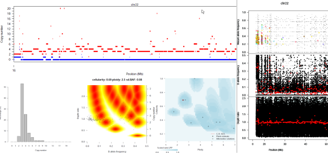

# sequenza
Sequenza workflow, Given a pair of cellularity and ploidy parameters, the function returns the most likely allele-specific
copy numbers with the corresponding log-posterior probability of the fit, for given values of B-allele
frequency and depth ratio.

## Usage



## Cromwell

``` 
 java -jar cromwell.jar run sequenza.wdl --inputs inputs.json 

```

## Running Pipeline

Pipeline is run with two wrapper scripts (one for pre-processing data and another - for running the analysis)

```
 Rscript SequenzaPreProcess_v2.2.R -s [.snp file] -c [.copynumber file] -y [female flag] -p [prefix]

 Rscript SequenzaProcess_v2.2.R -s [.seqz file] -l [ploidy file] -p [prefix]

```

## Optional Parameters with default values:

Paramter|Value
---|---
gammaRange | Array[String] (optional, default = range 50-2000 with step of 100)
ploidyFile | String (optional, default $SEQUENZA_RES_ROOT/PANCAN_ASCAT_ploidy_prob.Rdata)
modules | String, used by multiple tasks. Default modules: 

## Required Inputs:

Paramter|Value
---|---
cnvFile | File (data file with CNV calls from Varscan)
snpFile | File (data file with SNV calls from Varscan)
preprocessScript | R script for preprocessing Varscan calls
sequenzaScript | R script for wrapping sequenza


## Outputs

```
  resultZip          - all results from sequenza runs using gamma sweep

  resultJson         - combined json file with ploidy and contamination data

```
